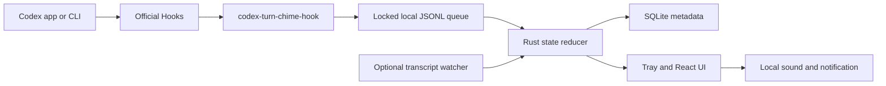

# CodexTurnChime

> **Independent project notice:** CodexTurnChime is an independent open-source project and is not affiliated with, endorsed by, or sponsored by OpenAI. Codex and OpenAI are trademarks of OpenAI.

CodexTurnChime is a local-first, cross-platform task status monitor and customizable sound notifier for Codex. It watches structured status events, keeps a small local history, and plays distinct sounds when a task needs input or a turn is ready.

[简体中文](README.zh-CN.md) · [Roadmap](ROADMAP.md) · [Privacy](docs/privacy.md) · [Troubleshooting](docs/troubleshooting.md)

## Why it exists

Long-running Codex tasks should not require constant visual checking. CodexTurnChime gives you a quiet system-tray dashboard and two useful audio signals:

- **Needs input** — a permission request or explicit user-input request is waiting.
- **Ready** — the current turn completed and is ready to review.

It never stores prompts, answers, command text, tool input, or tool output.

## v0.1 scope

- macOS 13+ on Apple Silicon
- Windows 11 x64
- Official Codex Hooks as the default event source
- Optional, read-only `codex-jsonl-v1` transcript watcher
- English and Simplified Chinese interface
- WAV and MP3 custom sounds, independent volume, mute, and preview
- Local SQLite metadata history with a fixed 30-day retention period
- Safe Hook preview, backup, idempotent install, and exact uninstall
- System tray, diagnostics, onboarding, and local desktop notifications

Not included in v0.1: Intel Mac, Windows ARM64, Linux, WSL sessions, task approval/control, App Server task creation, auto-update, stores, accounts, cloud sync, telemetry, or crash upload.

## Status model

CodexTurnChime uses one versioned schema, `MonitorEvent v1`:

```json
{
  "schema_version": 1,
  "event_id": "uuid-or-stable-transcript-id",
  "source": "codex_hook",
  "session_id": "session-id",
  "turn_id": "turn-id",
  "kind": "needs_input",
  "occurred_at": "2026-01-01T00:00:00Z",
  "cwd": "/path/to/project",
  "reason": "permission_requested"
}
```

Valid states are `running`, `needs_input`, `ready`, `stopped`, `blocked`, and `unknown`. A user interruption is always `stopped`, never `blocked`. There are no legacy-key aliases or guessed compatibility mappings.

## Architecture



See [Architecture](docs/architecture.md) and [Hook integration](docs/hooks.md) for the contracts and failure behavior.

## Development

Prerequisites:

- Node.js 22 LTS and npm
- Stable Rust with the required platform target
- Tauri 2 platform prerequisites

```bash
npm install
npm run dev
npm run tauri dev
```

The packaged Hook helper is a Tauri sidecar. Release builds first compile the helper and stage its target-triple name:

```bash
cargo build --manifest-path src-tauri/Cargo.toml --release --bin codex-turn-chime-hook --target aarch64-apple-darwin
node scripts/stage-sidecar.mjs aarch64-apple-darwin release
npm run tauri build -- --target aarch64-apple-darwin --bundles dmg
```

Run checks:

```bash
npm run lint
npm run typecheck
npm test
cargo fmt --manifest-path src-tauri/Cargo.toml --check
cargo clippy --manifest-path src-tauri/Cargo.toml --all-targets -- -D warnings
cargo test --manifest-path src-tauri/Cargo.toml
```

## Distribution warning for the beta

`v0.1.0-beta.1` is not signed with a paid Apple Developer ID or Windows code-signing certificate. macOS builds use ad-hoc signing; Windows installers are unsigned. Gatekeeper or SmartScreen may show a warning. Do not globally disable operating-system security features; verify the published SHA-256 checksum and release provenance instead.

## Project policies

- [Contributing](CONTRIBUTING.md)
- [Code of Conduct](CODE_OF_CONDUCT.md)
- [Security](SECURITY.md)
- [Support](SUPPORT.md)
- [Governance](GOVERNANCE.md)
- [Third-party notices](THIRD_PARTY_NOTICES.md)

The Hook design follows the official [Codex Hooks documentation](https://learn.chatgpt.com/docs/hooks). The transcript format is explicitly treated as unstable, and App Server remains a future capability described by the official [Codex App Server documentation](https://learn.chatgpt.com/docs/app-server). Original project branding follows the [OpenAI Brand Guidelines](https://openai.com/brand/) by not using or imitating OpenAI/Codex logos.

## License

[MIT](LICENSE) © CodexTurnChime contributors.
