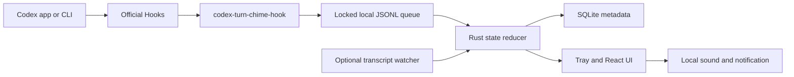

# CodexTurnChime

> **Independent project notice:** CodexTurnChime is an independent open-source project and is not affiliated with, endorsed by, or sponsored by OpenAI. Codex and OpenAI are trademarks of OpenAI.

CodexTurnChime is a local-first, cross-platform task status monitor and customizable sound notifier for Codex. It watches structured status events, keeps a small local history, and plays built-in bilingual AI voice prompts or custom sounds when a task needs input or a turn is ready.

[简体中文](README.zh-CN.md) · [Roadmap](ROADMAP.md) · [Privacy](docs/privacy.md) · [Troubleshooting](docs/troubleshooting.md)


## Why it exists

Long-running Codex tasks should not require constant visual checking. CodexTurnChime gives you a quiet system-tray dashboard and two useful audio signals:

- **Needs input** — a permission request or explicit user-input request is waiting.
- **Ready** — the current turn completed and is ready to review.

It never stores prompts, answers, command text, tool input, or tool output.

## Feature highlights

### Lumi bilingual AI voice

- **Lumi · AI Voice 01** is enabled by default and includes matching English and Simplified Chinese audio.
- The voice language follows the UI language automatically. Users select a voice scheme, not a separate audio language.
- Eight event-specific prompts distinguish permission requests, reply requests, general attention, completed turns, completed tasks, ready results, failures, and interruptions.
- The stable prompt IDs, spoken text, filenames, and audio requirements are documented in the [voice prompt catalog](docs/voice-prompt-catalog.md).

### Flexible sound controls

- Separate sound settings for attention events (`needs_input` and `blocked`) and outcome events (`ready` and `stopped`).
- Choose Lumi, the built-in chime, or a custom WAV/MP3 file, with preview and independent enable switches.
- Volume ranges from 0% to 200%. Playback above 100% uses dynamic compression to reduce harsh clipping.
- Global mute affects sound playback only; task collection and local notifications continue normally.

### Repeat reminders that stop when you return

- Attention and outcome reminders repeat every **5 seconds by default**; the interval can be configured from 1 to 60 seconds.
- Permission requests play once because Codex may complete the permission flow without a matching completion Hook.
- Bringing the main TurnChime window to the foreground immediately stops the current sound and cancels that reminder's repeat loop.
- A configurable global shortcut does the same while another app is active or TurnChime is hidden:
  - macOS default: `⌘⇧K`
  - Windows default: `Ctrl+Shift+K`
- The shortcut can be recorded, cleared to disable it, or restored to its default. A registration conflict rejects the change and restores the previous shortcut.
- Dismissing a reminder does not focus the window, mute future events, or mark a task as read. The next new event can alert normally.

### Task and health controls

- Mark one task as read or use **Mark all as read** for all unread tasks in one action.
- Keep a searchable local task list and structured event timeline with fixed 30-day retention.
- Diagnostics report Hook installation, helper availability, queue/database health, transcript compatibility, and global-shortcut registration failures.
- Clear all local history at any time without affecting Codex data.
- Closing the main window keeps monitoring active in the background. Reopen it from the macOS Dock, a tray-icon left click, or **Open Dashboard**; use the tray **Quit** command to exit completely.

## v0.1 scope

- macOS 13+ on Apple Silicon
- Windows 11 x64
- Official Codex Hooks as the default event source
- Optional, read-only `codex-jsonl-v1` transcript watcher
- English and Simplified Chinese interface
- Lumi bilingual AI voice prompts, built-in chime, and WAV/MP3 custom sounds
- Configurable 5-second repeat reminders and a global dismiss shortcut
- Independent sound controls, preview, mute, and volume amplification up to 200%
- Per-task and one-click mark-all-read actions
- Local SQLite metadata history with a fixed 30-day retention period
- Safe Hook preview, backup, idempotent install, and exact uninstall
- System tray, diagnostics, onboarding, and local desktop notifications

Not included in v0.1: Intel Mac, Windows ARM64, Linux, WSL sessions, task approval/control, App Server task creation, auto-update, stores, accounts, cloud sync, telemetry, or crash upload.

## Status model

CodexTurnChime uses one versioned schema, `MonitorEvent v1`:

```json
{
  "schema_version": 1,
  "event_id": "uuid-or-stable-transcript-id",
  "source": "codex_hook",
  "session_id": "session-id",
  "turn_id": "turn-id",
  "kind": "needs_input",
  "occurred_at": "2026-01-01T00:00:00Z",
  "cwd": "/path/to/project",
  "reason": "permission_requested"
}
```

Valid states are `running`, `needs_input`, `ready`, `stopped`, `blocked`, and `unknown`. A user interruption is always `stopped`, never `blocked`. There are no legacy-key aliases or guessed compatibility mappings.

## Architecture



See [Architecture](docs/architecture.md) and [Hook integration](docs/hooks.md) for the contracts and failure behavior.

## First-time setup

1. Start CodexTurnChime and open **Settings → Integration**.
2. Preview the Hook changes, then install the three lifecycle command Hooks.
3. Start or restart Codex CLI, enter `/hooks`, review the pending Hooks, and press `t` to trust all three.
4. Submit a Codex prompt. New structured events should appear in the task monitor; use **Diagnostics** if they do not.

Hook installation preserves unrelated Hooks and creates a backup before changing the supported `hooks.json` configuration. See [Hook integration](docs/hooks.md) and [Troubleshooting](docs/troubleshooting.md) for paths and recovery steps.

## Development

Prerequisites:

- Node.js 22 LTS and npm
- Stable Rust with the required platform target
- Tauri 2 platform prerequisites

On an Apple Silicon Mac, the development helper checks macOS/Xcode tools, activates or installs Node.js 22, checks Rust, installs npm dependencies when needed, builds the debug Hook sidecar, and then starts Tauri:

```bash
bash scripts/debug.sh
```

The environment check can also be run independently:

```bash
bash scripts/init_env.sh
```

The current environment scripts target macOS 13+ on Apple Silicon. For Windows development, install the prerequisites manually and use the standard commands:

```bash
npm install
npm run tauri dev
```

## Build macOS Apple Silicon packages

From the repository root, run:

```bash
bash scripts/build_macos_arm.sh
```

The script validates the environment, builds the frontend, compiles and stages the release Hook sidecar, and produces both formats:

```text
src-tauri/target/aarch64-apple-darwin/release/bundle/macos/CodexTurnChime.app
src-tauri/target/aarch64-apple-darwin/release/bundle/dmg/*.dmg
```

The `.app` is the application bundle; the `.dmg` is the distributable disk image. This macOS script does not cross-compile a Windows installer—Windows packages should be built on Windows or Windows CI.

## Build Windows x64 packages

On Windows 11 x64 with Node.js 22, stable Rust MSVC, Visual Studio C++ Build Tools, and the Tauri 2 prerequisites installed, run PowerShell from the repository root:

```powershell
powershell -ExecutionPolicy Bypass -File scripts/build_windows_x64.ps1
```

The script installs locked npm dependencies, builds the frontend and Windows Hook sidecar, and produces unsigned NSIS and MSI installers:

```text
src-tauri\target\x86_64-pc-windows-msvc\release\bundle\nsis\*.exe
src-tauri\target\x86_64-pc-windows-msvc\release\bundle\msi\*.msi
```

Run checks:

```bash
npm run lint
npm run typecheck
npm test
cargo fmt --manifest-path src-tauri/Cargo.toml --check
cargo clippy --manifest-path src-tauri/Cargo.toml --all-targets -- -D warnings
cargo test --manifest-path src-tauri/Cargo.toml
```

## Distribution warning for the beta

`v0.1.0-beta.2` is not signed with a paid Apple Developer ID or Windows code-signing certificate. macOS builds use ad-hoc signing; Windows installers are unsigned. Gatekeeper or SmartScreen may show a warning. Do not globally disable operating-system security features; verify the published SHA-256 checksum and release provenance instead.

## Project policies

- [Contributing](CONTRIBUTING.md)
- [Code of Conduct](CODE_OF_CONDUCT.md)
- [Security](SECURITY.md)
- [Support](SUPPORT.md)
- [Governance](GOVERNANCE.md)
- [Third-party notices](THIRD_PARTY_NOTICES.md)

The Hook design follows the official [Codex Hooks documentation](https://learn.chatgpt.com/docs/hooks). The transcript format is explicitly treated as unstable, and App Server remains a future capability described by the official [Codex App Server documentation](https://learn.chatgpt.com/docs/app-server). Original project branding follows the [OpenAI Brand Guidelines](https://openai.com/brand/) by not using or imitating OpenAI/Codex logos.

## License

[MIT](LICENSE) © CodexTurnChime contributors.
