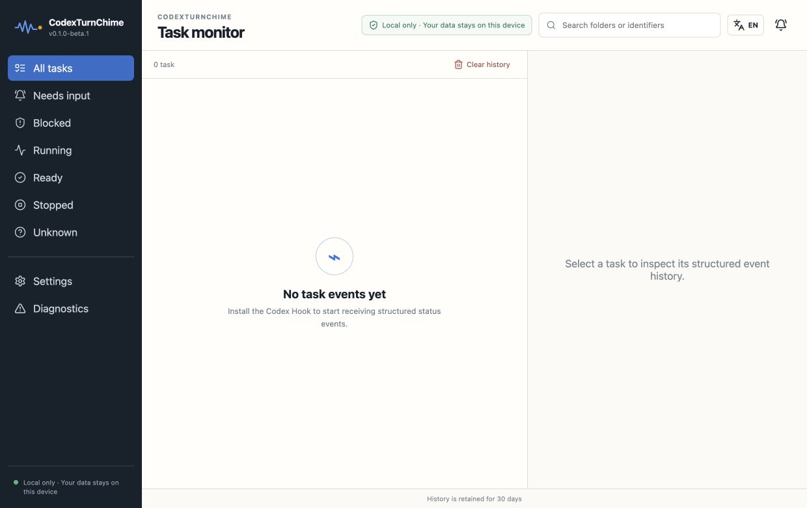
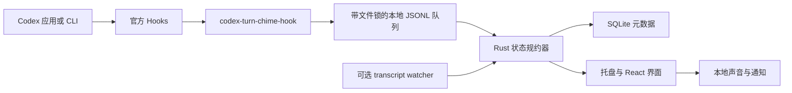

# CodexTurnChime

> **独立项目声明：** CodexTurnChime 是独立开源项目，与 OpenAI 无隶属、认可或赞助关系。Codex 与 OpenAI 是 OpenAI 的商标。

CodexTurnChime 是一个完全本地运行的 Codex 跨平台任务状态与自定义声音提醒工具。它接收结构化状态事件、保存少量本地历史，并在任务需要介入或轮次完成时播放内置双语 AI 人声或自定义提示音。

[English](README.md) · [路线图](ROADMAP.md) · [隐私](docs/privacy.zh-CN.md) · [故障排查](docs/troubleshooting.zh-CN.md)



## 为什么做这个项目

长时间运行 Codex 任务时，不应该一直盯着窗口。CodexTurnChime 提供安静的系统托盘控制台和两个真正有用的声音信号：

- **需要介入**：等待权限确认或明确的用户输入。
- **已完成**：当前轮次已结束，可以回来检查结果。

应用不会保存提示词、回答、命令文本、工具输入或工具输出。

## 功能亮点

### Lumi 双语 AI 人声

- 默认启用 **Lumi · AI 人声方案 1**，内置配套的简体中文与英文语音。
- 人声语言自动跟随 UI 语言；用户只选择人声方案，不需要单独选择语音语言。
- 8 段场景化语音分别对应：等待授权、等待回复、一般介入、轮次完成、任务完成、结果就绪、执行失败和任务中断。
- 固定序号、ID、播报文字、文件名和音频规格见[人声提示目录](docs/voice-prompt-catalog.md)。

### 灵活的声音控制

- “需要介入 / 执行失败”和“任务完成 / 已中断”两组事件可分别配置声音。
- 可选择 Lumi、内置提示音或自定义 WAV/MP3，支持试听和独立开关。
- 音量范围为 0%–200%；超过 100% 时自动加入动态压缩，尽量减少刺耳削波。
- 全局静音只停止声音，不影响任务事件收集和本地通知。

### 回来查看前持续提醒

- 介入和结果提醒默认每 **5 秒**重复一次，可在 1–60 秒范围内调整。
- 授权请求只播放一次，因为 Codex 可能自行完成授权流程而不再产生对应的结束 Hook。
- 当 TurnChime 主窗口回到最前方时，会立即停止当前声音并取消该条提醒的后续循环。
- 应用隐藏或正在使用其他应用时，也可以通过可配置的全局快捷键停止当前提醒：
  - macOS 默认：`⌘⇧K`
  - Windows 默认：`Ctrl+Shift+K`
- 快捷键支持按键录制、清除禁用和恢复默认；如果新组合格式无效或被占用，会拒绝保存并恢复旧快捷键。
- 停止提醒不会打开或聚焦窗口，不会开启全局静音，也不会把任务标为已读；下一条新事件仍会正常提醒。

### 任务与健康状态管理

- 可以单独标记任务为已读，也可以使用**全部标为已读**一次处理所有未读任务。
- 本地任务列表支持搜索，并展示结构化事件时间线；历史固定保留 30 天。
- 诊断页显示 Hook、helper、队列、数据库、transcript 兼容性，以及全局快捷键注册失败原因。
- 可随时清除 TurnChime 的本地历史，不影响 Codex 数据。
- 关闭主窗口后，监控会继续在后台运行。可以点击 macOS Dock 图标、左键单击托盘图标，或选择 **Open Dashboard** 重新打开；只有托盘菜单中的 **Quit** 才会完全退出。

## v0.1 范围

- macOS 13+ Apple Silicon
- Windows 11 x64
- 默认使用官方 Codex Hooks
- 可选、只读的 `codex-jsonl-v1` transcript watcher
- 中英双语界面
- Lumi 双语 AI 人声、内置提示音和 WAV/MP3 自定义声音
- 默认 5 秒的可配置重复提醒，以及全局停止提醒快捷键
- 独立声音控制、试听、静音和最高 200% 音量增强
- 单条任务和一键全部标为已读
- SQLite 本地结构化元数据，固定保留 30 天
- Hook 变更预览、备份、幂等安装和精确卸载
- 系统托盘、诊断、首次引导和本地桌面通知

首版不做：Intel Mac、Windows ARM64、Linux、WSL 会话、任务批准/控制、App Server 发起任务、自动更新、应用商店、账号、云同步、遥测或崩溃上传。

## 状态模型

项目只使用一个带版本的 `MonitorEvent v1`：

```json
{
  "schema_version": 1,
  "event_id": "uuid-or-stable-transcript-id",
  "source": "codex_hook",
  "session_id": "session-id",
  "turn_id": "turn-id",
  "kind": "needs_input",
  "occurred_at": "2026-01-01T00:00:00Z",
  "cwd": "/path/to/project",
  "reason": "permission_requested"
}
```

状态只有 `running`、`needs_input`、`ready`、`stopped`、`blocked` 和 `unknown`。用户中断永远是 `stopped`，不能映射成 `blocked`。不接受旧字段别名，也不猜测兼容格式。

## 核心架构



接口、错误策略和隐私边界见[架构文档](docs/architecture.zh-CN.md)与[Hook 接入文档](docs/hooks.zh-CN.md)。

## 首次接入

1. 启动 CodexTurnChime，进入**设置 → 集成**。
2. 先预览 Hook 变更，然后安装 3 个生命周期 command Hook。
3. 启动或重启 Codex CLI，输入 `/hooks`，审查待信任的 Hook，并按 `t` 信任全部 3 个 Hook。
4. 在 Codex 中提交一条提示；新的结构化事件应出现在任务监控页。如果没有数据，请打开**诊断**页检查。

Hook 安装会保留所有无关 Hook，并在修改受支持的 `hooks.json` 前创建备份。路径和恢复方式见 [Hook 接入文档](docs/hooks.zh-CN.md)与[故障排查](docs/troubleshooting.zh-CN.md)。

## 本地开发

需要 Node.js 22 LTS、npm、稳定版 Rust 和对应平台的 Tauri 2 依赖。

在 Apple Silicon Mac 上，可以直接使用开发脚本。它会检查 macOS/Xcode Command Line Tools、激活或安装 Node.js 22、检查 Rust、按需安装 npm 依赖、构建 debug Hook sidecar，然后启动 Tauri：

```bash
bash scripts/debug.sh
```

也可以只执行环境初始化：

```bash
bash scripts/init_env.sh
```

当前环境脚本只支持 macOS 13+ Apple Silicon。Windows 开发需要手动准备依赖，然后运行标准命令：

```bash
npm install
npm run tauri dev
```

## 打包 macOS Apple Silicon 版本

在项目根目录运行：

```bash
bash scripts/build_macos_arm.sh
```

脚本会检查环境、构建前端、编译并暂存 release Hook sidecar，最后同时生成两种格式：

```text
src-tauri/target/aarch64-apple-darwin/release/bundle/macos/CodexTurnChime.app
src-tauri/target/aarch64-apple-darwin/release/bundle/dmg/*.dmg
```

`.app` 是应用程序包，`.dmg` 是用于分发的磁盘镜像。这个 macOS 脚本不能交叉编译 Windows 安装包；Windows 版本应在 Windows 机器或 Windows CI 中构建。

## 打包 Windows x64 版本

在 Windows 11 x64 上安装 Node.js 22、稳定版 Rust MSVC、Visual Studio C++ Build Tools 和 Tauri 2 依赖后，在项目根目录运行 PowerShell：

```powershell
powershell -ExecutionPolicy Bypass -File scripts/build_windows_x64.ps1
```

脚本会安装 lockfile 固定的 npm 依赖、构建前端和 Windows Hook sidecar，并生成未签名的 NSIS 安装包。`beta.2` 这类 beta SemVer 标识不兼容 WiX/MSI 的版本规则，因此 beta 版本只生成 NSIS：

```text
src-tauri\target\x86_64-pc-windows-msvc\release\bundle\nsis\*.exe
```

完整检查命令见 [CONTRIBUTING.md](CONTRIBUTING.md)。

## Beta 分发提醒

`v0.1.0-beta.2` 没有正式 Apple Developer ID 或 Windows 代码签名证书。macOS 使用 ad-hoc signing，Windows 安装包未签名，Gatekeeper 或 SmartScreen 可能显示提醒。不要全局关闭系统安全功能；请核对发布页的 SHA-256、SBOM 和构建证明。

Hook 依据官方 [Codex Hooks 文档](https://learn.chatgpt.com/docs/hooks)。Transcript 格式被明确视为不稳定接口；App Server 只列入后续路线，参考官方 [Codex App Server 文档](https://learn.chatgpt.com/docs/app-server)。项目不使用也不模仿 OpenAI/Codex 官方 Logo，遵循 [OpenAI Brand Guidelines](https://openai.com/brand/)。

## 许可证

[MIT](LICENSE) © CodexTurnChime contributors。
