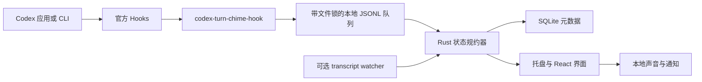

# CodexTurnChime

> **独立项目声明：** CodexTurnChime 是独立开源项目，与 OpenAI 无隶属、认可或赞助关系。Codex 与 OpenAI 是 OpenAI 的商标。

CodexTurnChime 是一个完全本地运行的 Codex 跨平台任务状态与自定义声音提醒工具。它接收结构化状态事件、保存少量本地历史，并在任务需要介入或轮次完成时播放不同提示音。

[English](README.md) · [路线图](ROADMAP.md) · [隐私](docs/privacy.zh-CN.md) · [故障排查](docs/troubleshooting.zh-CN.md)

## 为什么做这个项目

长时间运行 Codex 任务时，不应该一直盯着窗口。CodexTurnChime 提供安静的系统托盘控制台和两个真正有用的声音信号：

- **需要介入**：等待权限确认或明确的用户输入。
- **已完成**：当前轮次已结束，可以回来检查结果。

应用不会保存提示词、回答、命令文本、工具输入或工具输出。

## v0.1 范围

- macOS 13+ Apple Silicon
- Windows 11 x64
- 默认使用官方 Codex Hooks
- 可选、只读的 `codex-jsonl-v1` transcript watcher
- 中英双语界面
- WAV/MP3 自定义声音、独立音量、静音和试听
- SQLite 本地结构化元数据，固定保留 30 天
- Hook 变更预览、备份、幂等安装和精确卸载
- 系统托盘、诊断、首次引导和本地桌面通知

首版不做：Intel Mac、Windows ARM64、Linux、WSL 会话、任务批准/控制、App Server 发起任务、自动更新、应用商店、账号、云同步、遥测或崩溃上传。

## 状态模型

项目只使用一个带版本的 `MonitorEvent v1`：

```json
{
  "schema_version": 1,
  "event_id": "uuid-or-stable-transcript-id",
  "source": "codex_hook",
  "session_id": "session-id",
  "turn_id": "turn-id",
  "kind": "needs_input",
  "occurred_at": "2026-01-01T00:00:00Z",
  "cwd": "/path/to/project",
  "reason": "permission_requested"
}
```

状态只有 `running`、`needs_input`、`ready`、`stopped`、`blocked` 和 `unknown`。用户中断永远是 `stopped`，不能映射成 `blocked`。不接受旧字段别名，也不猜测兼容格式。

## 核心架构



接口、错误策略和隐私边界见[架构文档](docs/architecture.zh-CN.md)与[Hook 接入文档](docs/hooks.zh-CN.md)。

## 本地开发

需要 Node.js 22 LTS、npm、稳定版 Rust 和对应平台的 Tauri 2 依赖。

```bash
npm install
npm run tauri dev
```

Hook helper 作为 Tauri sidecar 打包。以 Apple Silicon DMG 为例：

```bash
cargo build --manifest-path src-tauri/Cargo.toml --release --bin codex-turn-chime-hook --target aarch64-apple-darwin
node scripts/stage-sidecar.mjs aarch64-apple-darwin release
npm run tauri build -- --target aarch64-apple-darwin --bundles dmg
```

完整检查命令见 [CONTRIBUTING.md](CONTRIBUTING.md)。

## Beta 分发提醒

`v0.1.0-beta.1` 没有正式 Apple Developer ID 或 Windows 代码签名证书。macOS 使用 ad-hoc signing，Windows 安装包未签名，Gatekeeper 或 SmartScreen 可能显示提醒。不要全局关闭系统安全功能；请核对发布页的 SHA-256、SBOM 和构建证明。

Hook 依据官方 [Codex Hooks 文档](https://learn.chatgpt.com/docs/hooks)。Transcript 格式被明确视为不稳定接口；App Server 只列入后续路线，参考官方 [Codex App Server 文档](https://learn.chatgpt.com/docs/app-server)。项目不使用也不模仿 OpenAI/Codex 官方 Logo，遵循 [OpenAI Brand Guidelines](https://openai.com/brand/)。

## 许可证

[MIT](LICENSE) © CodexTurnChime contributors。
