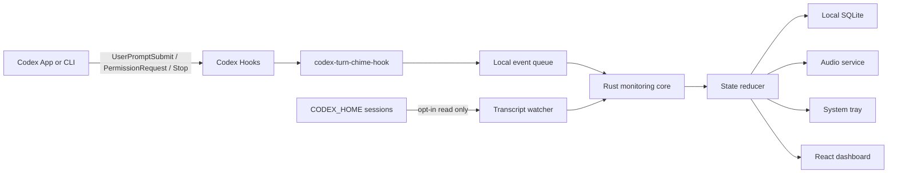

# CodexTurnChime GitHub 开源项目完整规划

> 文档状态：Approved plan
> 计划版本：1.0
> 对应产品版本：`v0.1.0-beta.2`
> 更新日期：2026-07-16
> GitHub Owner：`jgarrick1992`

## 1. 文档用途

本文是 CodexTurnChime 的产品、技术、开源治理和发布主计划，用于：

- 创建本地项目和 GitHub 公开仓库。
- 指导首版架构、实现顺序和接口边界。
- 拆分 GitHub Milestone、Issues 和验收条件。
- 约束隐私、安全、品牌和发布行为。
- 避免实现过程中临时引入字段兼容、范围扩大或不真实的状态映射。

本文不是已经完成的实现说明。本文落地时尚未创建仓库、应用代码或安装包。

## 2. 已锁定的项目决策

| 项目 | 决策 |
| --- | --- |
| 产品名称 | CodexTurnChime |
| 本地根目录 | `/Users/jifu/Public/0.00.Workspace/GitHub/Mac/codex-turn-chime` |
| GitHub 仓库 | `https://github.com/jgarrick1992/codex-turn-chime` |
| 仓库可见性 | Public |
| 默认分支 | `main` |
| 开源协议 | MIT |
| 首版版本 | `v0.1.0-beta.2` |
| 桌面技术 | Tauri 2 + React + TypeScript + Vite + Rust |
| 包管理 | npm，提交 `package-lock.json` |
| Rust 工具链 | Stable，提交 `Cargo.lock` |
| macOS | macOS 13+，Apple Silicon ARM64 |
| Windows | Windows 11，x64 |
| 应用语言 | 简体中文、英文 |
| 文档语言 | `README.md` 英文，`README.zh-CN.md` 中文 |
| 默认状态来源 | Codex 官方 Hook |
| 增强状态来源 | 用户主动开启的 transcript watcher |
| 数据策略 | 本地、最小化、无遥测、不保存对话正文 |
| 首版发布 | GitHub Draft Prerelease，无正式代码签名 |
| 首版不做 | Linux、Intel Mac、Windows ARM64、WSL、App Server 任务控制、自动更新、商店发布 |

应用标识固定为：

- Bundle identifier：`io.github.jgarrick1992.codexturnchime`
- 桌面可执行产品名：`CodexTurnChime`
- Hook helper：`codex-turn-chime-hook`
- 仓库 slug：`codex-turn-chime`

## 3. 品牌、命名与法律边界

CodexTurnChime 是第三方独立开源项目，不得使用户误以为它由 OpenAI 开发、赞助、审核或背书。

README、应用 About 页面和 Release 页面必须显著包含：

> CodexTurnChime is an independent open-source project and is not affiliated with, endorsed by, or sponsored by OpenAI. Codex and OpenAI are trademarks of OpenAI.

中文版：

> CodexTurnChime 是独立开源项目，与 OpenAI 无隶属关系，亦未获得 OpenAI 的认可、赞助或背书。Codex 与 OpenAI 是 OpenAI 的商标。

品牌约束：

- 不使用 OpenAI、ChatGPT 或 Codex 官方 Logo。
- 不模仿 OpenAI Blossom、产品图标、字体组合或官方应用图形。
- 项目图标采用原创的“提示音波纹 + 状态点”视觉方向。
- 产品描述可以说明兼容 Codex，但必须同时显示非官方声明。
- 不使用 `Official`、`by OpenAI`、`OpenAI approved` 等描述。
- 如果收到商标或品牌整改要求，应优先调整名称和视觉，而不是争辩或隐藏声明。

参考：[OpenAI Brand Guidelines](https://openai.com/brand/)

## 4. 产品目标与非目标

### 4.1 产品目标

CodexTurnChime 要解决的问题是：用户同时运行一个或多个 Codex 任务时，能够在不持续盯着 Codex 窗口的情况下知道任务是否正在执行、需要介入、已经完成或被中断，并为关键状态播放可以自定义的声音。

首版成功标准：

- macOS 和 Windows 均能常驻系统托盘。
- 能通过官方 Hook 识别 Running、Needs input 和 Ready。
- 用户主动开启增强监控后，可以识别普通 `request_user_input` 和用户中断。
- Needs input 与 Ready 使用两套独立声音设置。
- Hook 接入可以预览、安装、诊断、重复安装和完整卸载。
- 不保存提示词、回答、命令或工具输出正文。
- 内部格式变化时明确停用增强监控，官方 Hook 仍能工作。
- GitHub 项目具备完整的贡献、安全、CI、Release 和维护文档。

### 4.2 首版非目标

- 不从 CodexTurnChime 内批准命令或回答问题。
- 不启动、暂停、恢复或终止 Codex 任务。
- 不接入 Codex App Server 发起任务。
- 不支持 Linux、Intel Mac、Windows ARM64 或 WSL 内部会话。
- 不上传事件、日志、崩溃或使用统计。
- 不提供账号、云同步或远程访问。
- 不提供自动更新。
- 不发布到 Mac App Store 或 Microsoft Store。
- 不对 Codex 内部字段增加别名、旧 key、大小写变体或猜测性兼容映射。

## 5. 用户体验范围

### 5.1 首次启动

首次启动引导按以下顺序进行：

1. 显示产品用途、非官方声明和隐私摘要。
2. 检测 Codex Home，优先读取 `CODEX_HOME`，未设置时使用平台默认路径。
3. 解释官方 Hook 会修改用户级 Codex Hook 配置。
4. 展示将要添加的 Hook JSON diff。
5. 用户明确确认后才安装 Hook。
6. 测试 helper 是否可执行、事件队列是否可写。
7. 让用户分别试听 Needs input 和 Ready 默认声音。
8. 询问是否开机启动，默认关闭。
9. 说明增强监控会只读访问 transcript，默认关闭。

### 5.2 托盘菜单

托盘菜单保持短而清晰：

- 当前最高优先级状态。
- Running、Needs input、Ready 数量。
- 最近任务列表，显示工作目录简称、状态和更新时间。
- Open Dashboard。
- Mute / Unmute。
- Settings。
- Diagnostics。
- Quit。

多任务托盘优先级：

1. Needs input
2. Blocked
3. Ready
4. Running
5. Stopped
6. Unknown

### 5.3 主窗口

主窗口采用桌面侧栏与详情结构：

- 侧栏：全部、Needs input、Running、Ready、Stopped、Unknown。
- 列表行：状态、工作目录、最近更新时间。
- 详情：session ID、turn ID、状态来源、事件时间线、状态原因。
- 不展示 prompt、response、命令、工具输入或输出。
- 支持标记 Ready 为已读。
- 支持清除单个任务或全部本地历史。

### 5.4 设置页

设置分为四组：

- General：语言、开机启动、关闭窗口后保留托盘。
- Sounds：Needs input 和 Ready 的文件、音量、启用开关和试听。
- Integration：Hook 状态、安装、修复、卸载、增强监控开关。
- Privacy：数据路径、30 天保留策略、立即清除、隐私说明。

## 6. 总体架构



### 6.1 Tauri 主应用

职责：

- 创建系统托盘、主窗口和设置窗口。
- 读取本地事件队列并交给状态机。
- 运行用户主动开启的 transcript watcher。
- 保存最小化任务状态和事件历史。
- 播放提示音。
- 安装、诊断和卸载 Codex Hook。
- 管理语言、声音、保留期和开机启动设置。

### 6.2 Hook helper

`codex-turn-chime-hook` 是独立 Rust 二进制，必须：

- 从 stdin 读取一个官方 Hook JSON 对象。
- 只读取结构化字段，不读取 transcript 正文。
- 转换成唯一的 `MonitorEvent v1`。
- 追加写入应用数据目录内的 `hook-events.jsonl`。
- 写入完成后立即退出。
- 不启动网络监听。
- 不执行 Hook 输入中的任何字符串。
- 不因为自身故障阻止 Codex 继续工作。

应用未运行时，helper 仍可排队事件，但不会立即播放声音。首次引导应推荐用户开启登录启动，以保证实时提醒。

### 6.3 Transcript watcher

增强监控默认关闭。用户开启后：

- 只读访问 `CODEX_HOME/sessions`。
- 逐文件保存 byte offset，增量读取新行。
- 最后一行没有换行时先缓存，不解析半行。
- 只读取事件 envelope 和状态所需字段。
- 不读取或保存 message、prompt、response、tool input、tool output。
- 发现未知结构时将适配器置为 incompatible，并提示用户。
- 不尝试其他 key、旧字段或相似名称。
- 不写入 Codex 的 SQLite、session 或配置文件。

本机当前验证结构只作为 `codex-jsonl-v1` 适配器依据，不宣称是 OpenAI 稳定 API。

## 7. Codex 接入设计

### 7.1 官方 Hook 事件

首版安装以下事件：

| Hook | 状态 | 用途 |
| --- | --- | --- |
| `UserPromptSubmit` | Running | 用户提交新任务后开始执行 |
| `PermissionRequest` | Needs input | 等待授权或权限决定 |
| `Stop` | Ready | 当前 turn 停止并有结果可检查 |

Hook 是首版默认且主要的数据来源。参考：[Codex Hooks](https://learn.chatgpt.com/docs/hooks)

### 7.2 Hook 配置形状

安装器使用官方结构，实际路径由应用根据安装位置生成：

```json
{
  "hooks": {
    "UserPromptSubmit": [
      {
        "hooks": [
          {
            "type": "command",
            "command": "\"/absolute/path/codex-turn-chime-hook\"",
            "commandWindows": "\"C:\\\\Absolute\\\\Path\\\\codex-turn-chime-hook.exe\"",
            "timeout": 5
          }
        ]
      }
    ],
    "PermissionRequest": [
      {
        "hooks": [
          {
            "type": "command",
            "command": "\"/absolute/path/codex-turn-chime-hook\"",
            "commandWindows": "\"C:\\\\Absolute\\\\Path\\\\codex-turn-chime-hook.exe\"",
            "timeout": 5
          }
        ]
      }
    ],
    "Stop": [
      {
        "hooks": [
          {
            "type": "command",
            "command": "\"/absolute/path/codex-turn-chime-hook\"",
            "commandWindows": "\"C:\\\\Absolute\\\\Path\\\\codex-turn-chime-hook.exe\"",
            "timeout": 5
          }
        ]
      }
    ]
  }
}
```

这只是规划示例，不能在没有经过当前 Codex 版本验证时直接写入用户配置。

### 7.3 安装与卸载原则

安装流程：

1. 找到用户级 Hook 配置文件。
2. 读取并严格解析 JSON。
3. 解析失败时停止，不重写、不修复、不覆盖。
4. 构造变更后的完整 JSON。
5. 在 UI 展示 diff。
6. 用户确认。
7. 在同目录创建时间戳备份。
8. 写入同目录临时文件并 flush。
9. 原子替换目标文件。
10. 重新读取并验证结果。
11. 运行 helper 诊断事件。

重复安装必须幂等。判断依据是本产品生成的精确 handler，不使用模糊匹配。

卸载流程只删除与当前产品 helper 绝对路径和 handler 结构完全一致的条目。不得直接恢复旧备份覆盖用户在安装后新增的 Hook。

### 7.4 App Server 边界

Codex App Server 能提供线程、turn、item、授权和流式事件，适合由第三方客户端发起并管理 Codex 任务。首版只被动监控现有 Codex App/CLI，不引入 App Server 生命周期、认证或任务控制。

参考：[Codex App Server](https://learn.chatgpt.com/docs/app-server)

## 8. 统一事件与状态契约

### 8.1 MonitorEvent v1

唯一事件结构：

```json
{
  "schema_version": 1,
  "event_id": "uuid",
  "source": "codex_hook",
  "session_id": "session-id",
  "turn_id": "turn-id-or-null",
  "kind": "needs_input",
  "occurred_at": "2026-07-16T00:00:00Z",
  "cwd": "/workspace/path",
  "reason": "permission_request"
}
```

字段要求：

| 字段 | 类型 | 要求 |
| --- | --- | --- |
| `schema_version` | integer | 必须等于 `1` |
| `event_id` | UUID string | 必填、唯一 |
| `source` | enum | `codex_hook` 或 `codex_transcript` |
| `session_id` | string | 必填 |
| `turn_id` | string/null | Hook 没有时允许 null |
| `kind` | enum | 只允许固定状态枚举 |
| `occurred_at` | RFC 3339 string | 必填 |
| `cwd` | string/null | 只保存路径，不保存项目内容 |
| `reason` | enum/null | 只保存结构化原因 |

不允许添加 `prompt`、`message`、`response`、`command`、`input` 或 `output` 字段。

### 8.2 状态枚举

- `running`
- `needs_input`
- `ready`
- `stopped`
- `blocked`
- `unknown`

### 8.3 状态转换

| 来源事件 | 新状态 | 说明 |
| --- | --- | --- |
| Hook `UserPromptSubmit` | Running | 新任务开始 |
| transcript `task_started` | Running | 增强监控确认开始 |
| Hook `PermissionRequest` | Needs input | 等待授权 |
| `function_call` + `request_user_input` | Needs input | 等待普通问题回答 |
| 匹配的 `function_call_output` | Running | 用户回答后继续 |
| Hook `Stop` | Ready | turn 已停止，有结果可查看 |
| transcript `task_complete` | Ready | 增强监控确认完成 |
| `turn_aborted` + `reason: interrupted` | Stopped | 用户或系统中断，不是 Blocked |
| 明确失败终态 | Blocked | 只在存在明确失败证据时使用 |
| 未识别格式 | Unknown | 不猜测 |

不得把 `interrupted` 映射为 Blocked。本机已观察到的 `turn_aborted` 均为 `reason: interrupted`。

### 8.4 去重与顺序

- Hook event 使用 UUID 作为 `event_id`。
- transcript event 使用 session ID、文件标识、byte offset 和事件种类生成稳定 ID。
- SQLite 对 `event_id` 建唯一索引。
- 同一任务按 `occurred_at` 和本地接收顺序更新。
- 迟到的旧事件只写历史，不回退当前状态。
- Hook 与 transcript 报告同一状态时合并，优先保留官方 Hook 来源并记录增强确认。

这里的“合并”仅指同一规范事件去重，不是字段名兼容映射。

## 9. 本地数据设计

### 9.1 数据位置

使用平台标准应用数据目录：

- macOS：`~/Library/Application Support/io.github.jgarrick1992.codexturnchime/`
- Windows：`%APPDATA%\io.github.jgarrick1992.codexturnchime\`

建议文件：

- `codex-turn-chime.sqlite3`
- `settings.json`
- `hook-events.jsonl`
- `logs/`
- `backups/` 仅保存本产品创建的 Hook 配置备份索引

### 9.2 SQLite 表

`monitor_events`：

- `event_id` primary key
- `schema_version`
- `source`
- `session_id`
- `turn_id`
- `kind`
- `occurred_at`
- `cwd`
- `reason`
- `received_at`

`task_states`：

- `session_id`
- `turn_id`
- `current_kind`
- `last_event_id`
- `last_event_at`
- `is_read`
- `updated_at`

`watcher_checkpoints`：

- `source_path` primary key
- `file_identity`
- `byte_offset`
- `updated_at`

数据库迁移使用单向版本号。首版从 schema 1 开始，不为不存在的旧 schema 添加映射。

### 9.3 保留与清除

- 默认保留事件 30 天。
- 每次启动和每天一次清理过期记录。
- 用户可以立即清除全部状态历史。
- 清除历史不卸载 Hook、不删除声音文件、不修改 Codex 数据。
- 日志默认只记录事件类型、错误码和路径状态，不记录事件正文。

## 10. 声音与通知

### 10.1 声音类别

- Needs input sound
- Ready sound

每类设置：

- `enabled`
- `file_path`
- `volume`，范围 `0.0...1.0`
- Test action

首版支持 WAV 和 MP3。选择其他格式时直接拒绝并说明支持范围，不映射扩展名或猜测媒体类型。

### 10.2 播放规则

- 只有状态实际发生变化时播放。
- 重复事件去重后不重复播放。
- Needs input 优先于 Ready。
- 全局静音时不播放，但仍更新状态。
- 声音文件丢失或无权限时记录错误并在 UI 显示，不偷偷切换默认音。
- Test action 不生成 MonitorEvent，也不写任务历史。

### 10.3 系统通知

首版可以使用 Tauri notification plugin 显示本地通知，但通知正文只包含工作目录简称和状态，不包含 Codex 内容。

Codex 自身也提供任务完成、权限和问题通知，用户可以选择同时启用。参考：[Codex Notifications](https://learn.chatgpt.com/docs/notifications)

## 11. 隐私与安全模型

### 11.1 隐私承诺

- 所有处理在本机完成。
- 不需要 OpenAI API key。
- 不读取 Codex authentication 数据。
- 不读取或保存提示词、回复、命令或工具输出。
- 不包含遥测、分析 SDK、广告 SDK 或崩溃上传 SDK。
- 不建立网络服务或监听公网端口。
- 用户可以查看数据目录并一键清除本地历史。

### 11.2 Tauri 权限

仅启用实际需要的 capability：

- dialog：选择声音文件。
- notification：本地通知。
- autostart：用户明确开启后登录启动。
- single-instance：避免重复托盘进程。
- 最小文件读取范围：用户选择的声音文件和 opt-in 的 Codex session 路径。

首版不得启用通用 shell 执行能力。Hook 安装和文件操作由受限 Rust command 实现，不接受前端传入任意命令。

### 11.3 前端安全

- CSP 使用 `default-src 'self'` 为基础。
- 不加载远程脚本、远程字体或远程 iframe。
- 不把文件内容注入 HTML。
- Tauri command 参数使用强类型并在 Rust 侧验证。
- 外部链接通过系统浏览器打开，链接目标使用固定 allowlist。

### 11.4 Hook 配置风险

- 修改前必须展示 diff。
- 配置解析失败时停止。
- 备份与临时文件放在目标配置同一文件系统。
- 原子替换后立即重读验证。
- helper 路径必须是当前安装包内的绝对路径。
- 应用移动后诊断页应提示修复 Hook 路径。
- 卸载应用前提醒用户先卸载 Hook。

## 12. 推荐仓库结构

```text
codex-turn-chime/
├── .github/
│   ├── ISSUE_TEMPLATE/
│   │   ├── bug_report.yml
│   │   ├── feature_request.yml
│   │   ├── status_detection.yml
│   │   ├── platform_compatibility.yml
│   │   └── config.yml
│   ├── workflows/
│   │   ├── ci.yml
│   │   ├── codeql.yml
│   │   └── release.yml
│   ├── CODEOWNERS
│   ├── dependabot.yml
│   └── pull_request_template.md
├── docs/
│   ├── architecture.md
│   ├── hooks.md
│   ├── privacy.md
│   ├── releasing.md
│   ├── security-model.md
│   └── troubleshooting.md
├── src/
│   ├── components/
│   ├── features/
│   ├── i18n/
│   │   ├── en.json
│   │   └── zh-CN.json
│   ├── App.tsx
│   └── main.tsx
├── src-tauri/
│   ├── capabilities/
│   ├── icons/
│   ├── src/
│   │   ├── bin/
│   │   │   └── codex-turn-chime-hook.rs
│   │   ├── audio/
│   │   ├── hooks/
│   │   ├── monitor/
│   │   ├── persistence/
│   │   ├── watcher/
│   │   ├── lib.rs
│   │   └── main.rs
│   ├── Cargo.toml
│   └── tauri.conf.json
├── tests/
│   └── fixtures/
├── CHANGELOG.md
├── CODE_OF_CONDUCT.md
├── CONTRIBUTING.md
├── GOVERNANCE.md
├── LICENSE
├── README.md
├── README.zh-CN.md
├── ROADMAP.md
├── SECURITY.md
├── SUPPORT.md
├── THIRD_PARTY_NOTICES.md
├── package.json
└── package-lock.json
```

## 13. GitHub 仓库初始化清单

### 13.1 创建仓库

- [ ] 在 `jgarrick1992` 账号创建 public repository：`codex-turn-chime`
- [ ] 不使用 GitHub 自动生成 README、License 或 `.gitignore`，避免与本地初始化冲突
- [ ] 在本地目标路径创建项目目录
- [ ] `git init -b main`
- [ ] 配置 `origin` 为 `https://github.com/jgarrick1992/codex-turn-chime.git`
- [ ] 添加完整基础文件后进行首个提交
- [ ] 推送 `main`

### 13.2 仓库描述与 Topics

Repository description：

> Independent cross-platform task status and sound notifier for Codex.

建议 Topics：

- `codex`
- `tauri`
- `rust`
- `react`
- `desktop-app`
- `notifications`
- `system-tray`
- `macos`
- `windows`
- `open-source`

### 13.3 社区健康文件

- `README.md`
- `README.zh-CN.md`
- `LICENSE`
- `CONTRIBUTING.md`
- `CODE_OF_CONDUCT.md`
- `SECURITY.md`
- `SUPPORT.md`
- `GOVERNANCE.md`
- Issue Forms
- Pull Request Template

参考：[GitHub Community Health Files](https://docs.github.com/en/communities/setting-up-your-project-for-healthy-contributions/creating-a-default-community-health-file)

## 14. README 必须包含的内容

英文和中文 README 保持相同信息结构：

1. 产品名称和一句话描述。
2. 非官方与商标声明。
3. 当前 beta 状态。
4. 功能截图或 GIF 占位，未有真实界面前不得使用伪截图。
5. 功能列表。
6. 支持平台矩阵。
7. 隐私承诺。
8. 安装说明。
9. 无签名预览包警告。
10. Hook 修改说明。
11. 从源码开发的前置条件。
12. 常用 npm/Cargo 命令。
13. 测试说明。
14. Roadmap。
15. Contributing、安全报告和支持链接。
16. MIT License。

## 15. 贡献与治理

### 15.1 分支策略

- `main` 始终保持可测试状态。
- 所有功能通过短生命周期 feature branch 和 Pull Request 合并。
- 禁止直接向受保护 `main` 推送。
- PR 至少需要 CI 全部通过。
- 维护者可以在项目早期自审合并，但必须留下 PR 记录。
- Release tag 只能指向 `main` 上已通过 CI 的提交。

### 15.2 Commit 规范

采用 Conventional Commits：

- `feat:` 新功能
- `fix:` Bug 修复
- `docs:` 文档
- `test:` 测试
- `refactor:` 行为不变重构
- `build:` 构建或依赖
- `ci:` GitHub Actions
- `chore:` 维护

首版不强制所有外部贡献者签名 commit，以降低贡献门槛。

### 15.3 标签体系

类型：

- `type: bug`
- `type: feature`
- `type: docs`
- `type: refactor`
- `type: security`

区域：

- `area: hooks`
- `area: watcher`
- `area: audio`
- `area: ui`
- `area: persistence`
- `area: release`

平台：

- `platform: macos`
- `platform: windows`

优先级：

- `priority: p0`
- `priority: p1`
- `priority: p2`
- `priority: p3`

贡献：

- `good first issue`
- `help wanted`
- `needs info`
- `blocked`

## 16. Issue Forms

### 16.1 Bug report

必填：

- 应用版本
- 操作系统与架构
- Codex surface：Desktop App 或 CLI
- 是否启用增强监控
- 预期行为
- 实际行为
- 复现步骤
- 诊断摘要

明确提醒用户删除对话内容、token、用户名和私人路径后再提交日志。

### 16.2 Status detection issue

必填：

- 错误状态与预期状态
- 事件来源：Hook 或 transcript watcher
- 发生时间
- 是否可以使用脱敏结构化事件 fixture 复现

不得要求用户公开完整 transcript。

### 16.3 Security issue

SECURITY.md 要求漏洞通过 GitHub Private Vulnerability Reporting 报告，不使用公开 Issue 披露未修复漏洞。

## 17. CI 设计

### 17.1 Pull Request CI

触发：

- `pull_request`
- push to `main`

前端检查：

- `npm ci`
- lint
- TypeScript typecheck
- unit tests
- production frontend build check

Rust 检查：

- `cargo fmt --check`
- `cargo clippy --all-targets --all-features -- -D warnings`
- `cargo test --workspace`
- `cargo audit`
- `cargo deny check`

平台矩阵：

- `macos-latest`，target `aarch64-apple-darwin`
- `windows-latest`，target `x86_64-pc-windows-msvc`

不在普通 PR 上创建 Release。

### 17.2 CodeQL

- 扫描 JavaScript/TypeScript。
- Rust 使用 clippy、audit、deny 和依赖审查补充。
- 定期运行并在 `main` push/PR 时运行。

### 17.3 Dependabot

配置三个 ecosystem：

- npm
- Cargo
- GitHub Actions

每周更新并按生态分组，避免大量零散 PR。

### 17.4 分支保护

`main` 要求：

- Pull Request 合并。
- Required status checks。
- 分支必须为最新状态。
- 禁止 force push。
- 禁止删除分支。
- 对管理员是否豁免可在项目初期保留，但 Release 前不得绕过 CI。

## 18. Release 设计

### 18.1 版本与触发

- 使用 Semantic Versioning。
- 第一个公开 tag：`v0.1.0-beta.2`。
- `v*` tag 触发 `release.yml`。
- GitHub Release 构建阶段使用 `draft: true`、`prerelease: true`。
- macOS 与 Windows 构建全部成功后，工作流自动公开 prerelease。

### 18.2 构建矩阵

macOS：

- Runner：`macos-latest`
- Target：`aarch64-apple-darwin`
- Minimum system：macOS 13
- Bundle：DMG
- 无 Developer ID 时使用 ad-hoc signing

Windows：

- Runner：`windows-latest`
- Target：`x86_64-pc-windows-msvc`
- Minimum system：Windows 11
- Bundle：beta 版本使用 NSIS EXE；数字稳定版本再启用 MSI
- 首版无 Authenticode 正式签名

参考：[Tauri GitHub Pipeline](https://v2.tauri.app/distribute/pipelines/github/)

### 18.3 Release 资产

每个 Release 至少包含：

- macOS ARM64 DMG
- Windows x64 NSIS installer
- `checksums-sha256.txt`
- 前端 CycloneDX SBOM
- Rust CycloneDX SBOM
- Release notes
- GitHub artifact attestations

参考：[GitHub Artifact Attestations](https://docs.github.com/en/actions/how-tos/secure-your-work/use-artifact-attestations/use-artifact-attestations)

### 18.4 无签名安装说明

macOS：

- 明确说明 beta 包没有 Apple Developer ID notarization。
- 优先说明通过 Finder 的 Open 操作确认单个应用。
- 不指导用户全局关闭 Gatekeeper。

Windows：

- 明确说明 beta 包没有 Authenticode 证书。
- 说明 SmartScreen 可能显示 Unknown Publisher。
- 提供 SHA-256 与 artifact attestation 验证方法。
- 不指导用户全局关闭 SmartScreen。

### 18.5 后续签名预留

Release workflow 预留但不要求以下 secrets：

- Apple certificate、password、signing identity、Apple ID、app-specific password、Team ID
- Windows certificate 或受支持的云签名凭据

任何 secret 不得写入仓库、Issue、日志或文档示例值。

## 19. 供应链与依赖安全

- 提交 npm 与 Cargo lockfile。
- GitHub dependency graph 保持启用。
- 启用 Dependabot alerts 和 security updates。
- PR 显示依赖变化。
- `cargo-deny` 检查许可证、漏洞、重复依赖和来源。
- 第三方声音、字体、图标必须记录来源和再分发许可。
- Release 生成 SBOM、SHA-256 和 provenance attestation。
- GitHub Actions 优先使用官方 action；第三方 action 固定到审核过的版本或 commit SHA。
- Release 发布后不替换同名资产；修复应发布新版本。

参考：[GitHub Supply Chain Security](https://docs.github.com/en/code-security/concepts/supply-chain-security/supply-chain-security)

## 20. 测试计划

### 20.1 Rust 单元测试

- Hook JSON 正常解析。
- 缺少必填字段返回明确错误。
- 未知 Hook event 生成 Unknown 或被明确忽略。
- MonitorEvent v1 序列化和反序列化。
- 状态优先级。
- 事件去重。
- 迟到事件不回退状态。
- `interrupted` 转换为 Stopped。
- 不存在明确失败事件时不生成 Blocked。
- 30 天保留清理。
- 自定义声音扩展名和路径校验。

### 20.2 Hook 安装器测试

- 空配置安装。
- 已有无关 Hook 保留。
- 重复安装幂等。
- 无效 JSON 拒绝写入。
- 备份创建。
- 临时文件写入失败回滚。
- 原子替换后验证。
- macOS command quoting。
- Windows commandWindows quoting。
- 卸载只删除精确 handler。
- 用户安装后新增 Hook 不被卸载覆盖。

### 20.3 Transcript watcher fixture 测试

- `task_started` → Running。
- `task_complete` → Ready。
- `request_user_input` function call → Needs input。
- 匹配 output → Running。
- `turn_aborted` + `interrupted` → Stopped。
- JSONL 半行不解析。
- 文件追加从 checkpoint 继续。
- 文件轮转和 identity 变化。
- 重复行去重。
- 未知结构使适配器进入 incompatible。
- 未保存任何消息正文。

### 20.4 前端测试

- 状态列表与筛选。
- 多任务优先级。
- 中英文切换。
- 静音和音量设置。
- Hook diff 确认流程。
- 增强监控隐私确认。
- 数据清除确认。
- 错误和 incompatible 状态展示。

### 20.5 跨平台集成测试

- helper stdin → queue → Rust core → SQLite → UI。
- Needs input 和 Ready 各播放一次正确声音。
- 托盘关闭窗口后仍运行。
- Single instance。
- 登录启动开关。
- 应用移动后 Hook 诊断。
- macOS 13+ Apple Silicon 真机。
- Windows 11 x64 真机。

### 20.6 Release 验收

- 干净 runner 生成所有资产。
- 安装包名称和版本正确。
- Checksums 可验证。
- SBOM 可打开。
- Artifact attestation 可验证。
- Draft Prerelease 未自动公开。
- README 安装警告与当前签名状态一致。

## 21. Milestone 与 Issue 拆分

### Milestone M0：Repository Foundation

- 创建 GitHub public repository。
- 初始化本地仓库和 Tauri 2 工程。
- 添加 MIT License 与双语 README。
- 添加治理、安全、支持和贡献文档。
- 添加 Issue Forms、PR template、CODEOWNERS。
- 配置基础 CI 与 Dependabot。

完成条件：Community profile 完整，空功能项目 CI 通过。

### Milestone M1：Event Core

- 定义 MonitorEvent v1。
- 实现状态枚举、优先级和 reducer。
- 实现 SQLite schema 1。
- 实现 hook event queue。
- 实现 `codex-turn-chime-hook`。
- 添加事件、状态、去重和隐私测试。

完成条件：命令行 fixture 能稳定生成任务状态，数据库不含正文。

### Milestone M2：Tray and Sounds

- 实现托盘菜单。
- 实现主窗口与状态筛选。
- 实现中英 i18n。
- 实现 Needs input 与 Ready 声音设置。
- 实现试听、静音、本地通知。
- 实现 30 天保留和清除。

完成条件：模拟事件能驱动 UI 和两类声音。

### Milestone M3：Safe Hook Integration

- 检测 Codex Home 和 Hook 配置。
- 实现 diff 预览。
- 实现备份、原子安装和验证。
- 实现诊断与修复。
- 实现精确卸载。
- 完成 macOS 和 Windows quoting 测试。

完成条件：已有用户 Hook 不丢失，重复安装和卸载可验证。

### Milestone M4：Optional Transcript Watcher

- 实现 opt-in 隐私确认。
- 实现文件发现、增量读取和 checkpoint。
- 实现 `codex-jsonl-v1` 解析器。
- 实现普通问题和中断状态。
- 实现 incompatible fail-closed。
- 添加脱敏 fixtures。

完成条件：未知格式不误报、不读取正文、官方 Hook 不受影响。

### Milestone M5：Beta Release

- 完成 macOS ARM64 和 Windows x64 CI。
- 完成 CodeQL、audit、deny。
- 生成 SBOM、checksum、attestation。
- 完成真机安装与卸载测试。
- 完成 Release notes 和已知问题。
- 发布 `v0.1.0-beta.2` Prerelease。

完成条件：两个平台安装包、验证资产和文档全部齐全。

## 22. Definition of Done

一个功能只有同时满足以下条件才完成：

- 行为符合本规划和对应 Issue acceptance criteria。
- 没有新增对话正文持久化。
- 没有字段兼容映射。
- Rust fmt、clippy、tests 通过。
- TypeScript lint、typecheck、tests 通过。
- 中英文 UI 文案同步。
- 用户可见错误有明确说明。
- 相关文档已更新。
- PR CI 全绿。

`v0.1.0-beta.2` 只有同时满足以下条件才能公开：

- macOS 13+ Apple Silicon 真机通过。
- Windows 11 x64 真机通过。
- Hook 安装和卸载不破坏已有配置。
- Needs input 与 Ready 提示音可独立配置。
- `interrupted` 不显示为 Blocked。
- transcript watcher 关闭时不读取 session。
- transcript watcher 不兼容时自动停用。
- Release 资产、checksums、SBOM 和 attestations 完整。
- 无签名警告和安装说明准确。

## 23. 风险登记

| 风险 | 影响 | 对策 |
| --- | --- | --- |
| Codex transcript 格式变化 | 增强监控失效或误判 | 默认关闭、严格 schema、fail-closed、脱敏 fixture |
| Hook schema 或加载规则变化 | 默认状态来源失效 | 依据官方 Hook 文档、版本诊断、清晰错误 |
| 修改用户 Hook 配置失败 | 用户配置受损 | diff、备份、同目录临时文件、原子替换、重读验证 |
| 应用未在后台运行 | 事件排队但声音延迟 | 首次引导说明并提供登录启动 |
| 自定义声音失效 | 无提醒 | 显示路径错误、提供试听和诊断，不偷偷 fallback |
| 无签名包被系统拦截 | 安装困难 | ad-hoc signing、checksums、attestation、准确安装说明 |
| 产品名造成官方混淆 | 品牌或下架风险 | 显著非官方声明、原创图标、不使用官方 Logo |
| Issue 或日志泄露对话内容 | 隐私风险 | 日志最小化、Issue 模板提醒脱敏、Private Vulnerability Reporting |
| 多任务重复事件 | 重复声音或状态闪烁 | 唯一 event ID、数据库唯一索引、source-aware 去重 |

## 24. 后续版本方向

不承诺具体日期，按用户反馈评估：

- 正式 Apple notarization 和 Windows code signing。
- Tauri updater。
- Intel Mac 或 Windows ARM64。
- 更多自定义通知策略。
- App Server 模式，由 CodexTurnChime 发起和管理任务。
- 可插拔 agent adapter，但每个 adapter 使用独立明确 schema，不共享模糊兼容逻辑。

## 25. 参考资料

- [OpenAI Brand Guidelines](https://openai.com/brand/)
- [Codex Hooks](https://learn.chatgpt.com/docs/hooks)
- [Codex App Server](https://learn.chatgpt.com/docs/app-server)
- [Codex Notifications](https://learn.chatgpt.com/docs/notifications)
- [Codex Pets](https://learn.chatgpt.com/docs/pets)
- [GitHub Community Health Files](https://docs.github.com/en/communities/setting-up-your-project-for-healthy-contributions/creating-a-default-community-health-file)
- [GitHub Supply Chain Security](https://docs.github.com/en/code-security/concepts/supply-chain-security/supply-chain-security)
- [GitHub Artifact Attestations](https://docs.github.com/en/actions/how-tos/secure-your-work/use-artifact-attestations/use-artifact-attestations)
- [Tauri GitHub Pipeline](https://v2.tauri.app/distribute/pipelines/github/)
- [Tauri macOS Code Signing](https://v2.tauri.app/distribute/sign/macos/)
- [Tauri Windows Code Signing](https://v2.tauri.app/distribute/sign/windows/)

## 26. 当前阶段交付边界

本阶段只交付本文档。

尚未执行：

- 创建 `/Users/jifu/Public/0.00.Workspace/GitHub/Mac/codex-turn-chime`
- 初始化 Git 仓库
- 创建 GitHub repository
- 添加远程 `origin`
- 创建 Tauri 工程
- 写入任何应用代码
- 执行 build 或 test
- 创建 tag 或 Release

下一执行阶段应从 Milestone M0 开始，并保持上述路径、平台、隐私和兼容性边界。
